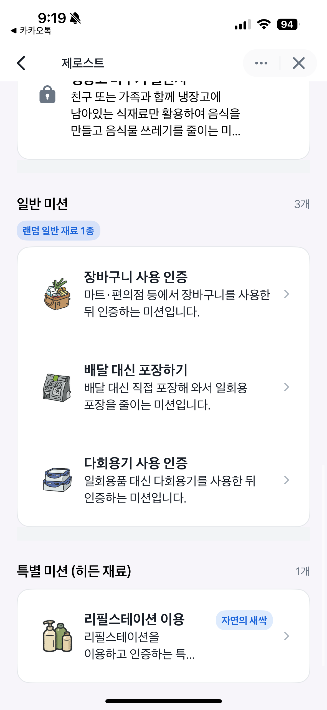
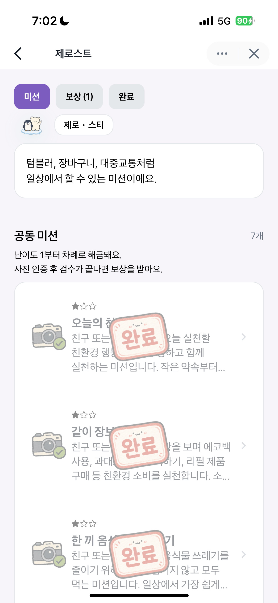
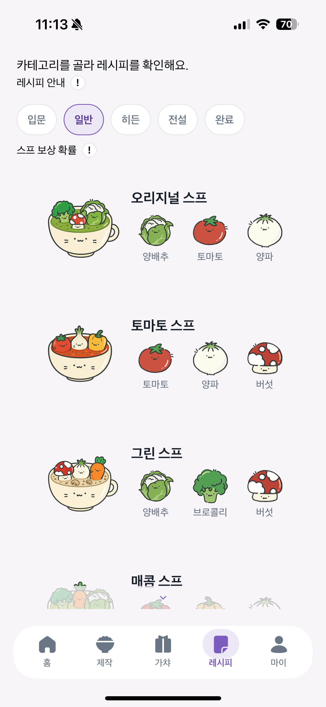
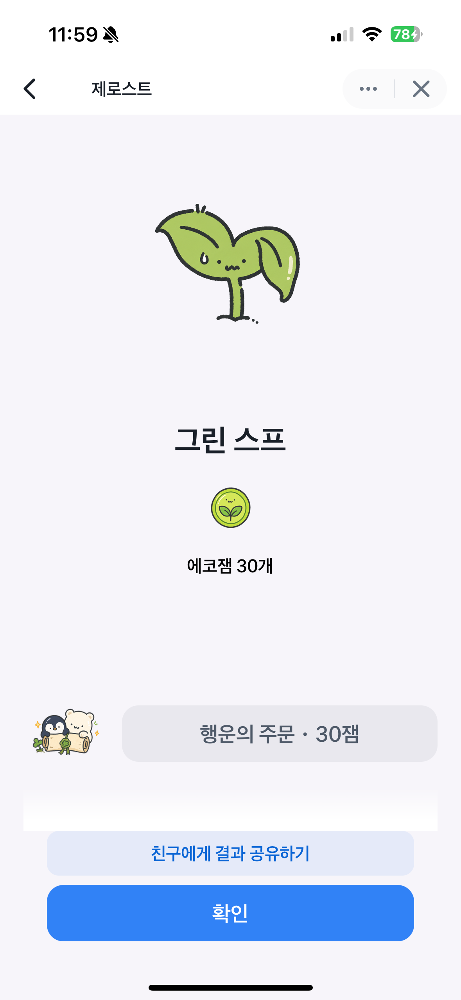
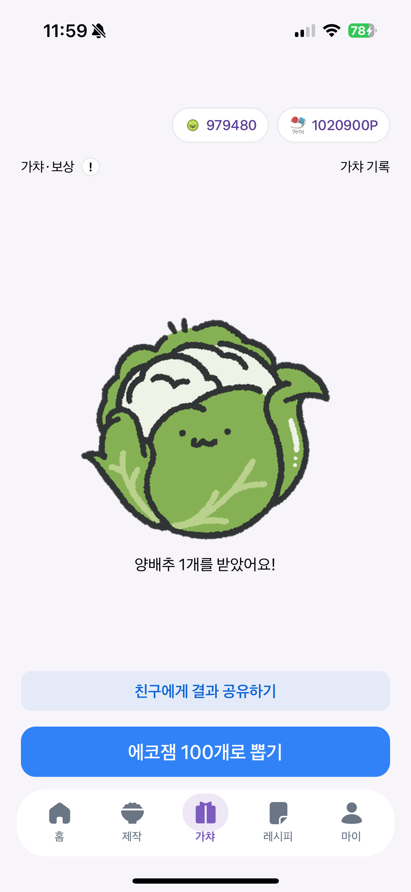
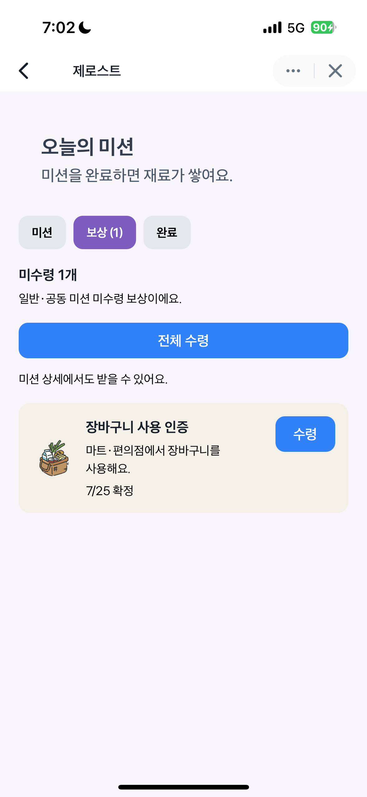

# ZeroSt Backend

제로웨이스트 실천을 **미션, 재료 수집, 레시피, 스프 제작, 가챠 보상**으로 연결한 게이미피케이션 백엔드입니다.  
사용자가 친환경 행동을 인증하고, 그 결과를 재료와 보상으로 돌려받아 다시 다음 행동으로 이어지도록 Kotlin + Spring Boot 기반으로 구현했습니다.

## 프로젝트 구조

```text
BE/
├── src/
│   ├── main/
│   │   ├── kotlin/com/zerost/api/
│   │   │   ├── auth/              # 로그인, JWT 발급/재발급, 로그아웃
│   │   │   ├── user/              # 회원가입, 온보딩, 닉네임 변경
│   │   │   ├── profile/           # 선택형 프로필 캐릭터 조회/변경
│   │   │   ├── mission/           # 오늘의 미션, 인증 제출, 검수, 보상 수령
│   │   │   ├── communitymission/  # 공동 미션, 단계형 인증, 검수, 성공 처리
│   │   │   ├── recipe/            # 레시피 조회, 히든 레시피 해금
│   │   │   ├── soup/              # 스프 제작, 보상, 리롤
│   │   │   ├── gacha/             # 에코잼 가챠
│   │   │   ├── reward/            # 보상 탭 조회, 일괄 수령
│   │   │   ├── history/           # 에코잼/포인트 이력 조회
│   │   │   ├── checkin/           # 출석 체크
│   │   │   ├── ingredient/        # 사용자 보유 재료 조회
│   │   │   ├── file/              # S3 업로드
│   │   │   ├── shop/              # 상점 조회
│   │   │   ├── admin/asset/       # 관리자 자산 지급
│   │   │   ├── testerlink/        # 테스트 링크 관리
│   │   │   └── common/            # 인증, 설정, 예외, 공통 응답/유틸
│   │   └── resources/
│   │       ├── application.yaml
│   │       └── db/migration/      # Flyway 마이그레이션
│   └── test/
│       └── kotlin/com/zerost/api/ # 서비스/컨트롤러/동시성 테스트
├── docs/
│   ├── deployment.md              # 배포 운영 메모
│   └── portfolio/                 # 설계/트러블슈팅 문서
├── nginx/                         # dev/prod Nginx 설정
├── scripts/                       # 배포 스크립트
└── terraform/                     # AWS 인프라 코드
```

## 주요 기능

- 휴대전화 번호 + 비밀번호 기반 인증
- 오늘의 미션 일일 편성, 인증 제출/수정/삭제, 관리자 검수
- 공동 미션 단계형 인증 제출, 관리자 검수, 달성률 기반 성공 처리
- 입문 / 일반 / 히든 / 전설 레시피 조회
- 스프 제작, 보상 지급, 리롤
- 에코잼 가챠
- 재료 / 에코잼 / 포인트 이력 조회
- 보상 탭 조회 및 수령

## 서비스 화면

<table>
  <tr>
    <th width="33.33%">오늘의 미션</th>
    <th width="33.33%">공동 미션</th>
    <th width="33.33%">레시피</th>
  </tr>
  <tr>
    <td width="33.33%" align="center">
      
    </td>
    <td width="33.33%" align="center">
      
    </td>
    <td width="33.33%" align="center">
      
    </td>
  </tr>
  <tr>
    <td width="33.33%" align="center">
      일일 미션 편성, 상태 확인, 보상 탭 흐름<br />
      <a href="docs/assets/mission-list-status.png">상태 화면</a> ·
      <a href="docs/assets/mission-reward-tab.png">보상 탭</a>
    </td>
    <td width="33.33%" align="center">
      단계형 인증과 완료 상태 중심의 공동 미션 구조<br />
      <a href="docs/assets/community-mission-list.png">목록 화면</a>
    </td>
    <td width="33.33%" align="center">
      일반 / 히든 레시피를 구분해 탐색하는 화면<br />
      <a href="docs/assets/recipe-hidden-list.png">히든 레시피</a>
    </td>
  </tr>
  <tr>
    <th width="33.33%">스프 제작 / 리롤</th>
    <th width="33.33%">에코잼 가챠</th>
    <th width="33.33%">보상 탭</th>
  </tr>
  <tr>
    <td width="33.33%" align="center">
      
    </td>
    <td width="33.33%" align="center">
      
    </td>
    <td width="33.33%" align="center">
      
    </td>
  </tr>
  <tr>
    <td width="33.33%" align="center">
      재료 조합, 제작 결과, 리롤까지 이어지는 흐름<br />
      <a href="docs/assets/soup-brew-intro.png">소개 화면</a> ·
      <a href="docs/assets/soup-brew-ingredients.png">재료 선택</a>
    </td>
    <td width="33.33%" align="center">
      에코잼 사용 후 포인트 / 재료 / 보상을 획득하는 가챠 흐름<br />
      <a href="docs/assets/gacha-intro.png">소개 화면</a> ·
      <a href="docs/assets/gacha-ingredients.png">재료 보상</a>
    </td>
    <td width="33.33%" align="center">
      미수령 보상 조회와 수령 흐름<br />
      <a href="docs/assets/mission-list-status.png">미션 상태</a>
    </td>
  </tr>
</table>

<table>
  <tr>
    <th width="33.33%">스프 제작 데모</th>
    <th width="33.33%">스프 리롤 데모</th>
    <th width="33.33%">에코잼 가챠 데모</th>
  </tr>
  <tr>
    <td width="33.33%" align="center">
      <video src="docs/assets/soup-brew-demo.mp4" controls width="220"></video>
    </td>
    <td width="33.33%" align="center">
      <video src="docs/assets/soup-reroll-demo.mp4" controls width="220"></video>
    </td>
    <td width="33.33%" align="center">
      <video src="docs/assets/gacha-demo.mp4" controls width="220"></video>
    </td>
  </tr>
</table>

## 주요 설계와 구현

### 도메인 설계

[**공동 미션 진행률 계산과 완료 구조**](docs/portfolio/community-mission-progress-and-completion.md)  
공동 미션은 개인 미션처럼 한 사람의 완료 여부만으로 끝나는 기능이 아니었습니다. 전체 유저 대비 달성 비율, 단계 해금, 성공 판정을 함께 다뤄야 해서 공동 미션을 별도 도메인으로 분리하고 완료 데이터와 집계 구조를 나눠 설계했습니다.

[**공동 미션 단계형 인증 제출과 검수 흐름**](docs/portfolio/community-mission-proof-review-flow.md)  
공동 미션은 하루짜리 인증으로 끝나지 않았습니다. requirement별 proof 구조 위에 `PENDING / APPROVED / REJECTED` 상태를 올리고, 모든 단계가 승인된 뒤에만 완료할 수 있도록 흐름을 확장했습니다.

[**스프 리롤 보상 교체 정합성 처리**](docs/portfolio/soup-reroll-consistency.md)  
리롤은 “한 번 더 뽑기”가 아니라 이미 지급된 보상을 되돌리고 최종 결과를 교체하는 기능이었습니다. 에코잼, 포인트, 재료, 지급 이력을 함께 회수하고 다시 적용하는 흐름으로 정리했습니다.

### 정합성과 동시성

[**미션 제출 동시성 제어**](docs/portfolio/mission-submit-concurrency.md)  
같은 유저가 같은 미션을 동시에 제출할 때 중복 제출이 생길 수 있었습니다. 제출 대상과 사용자 상태를 비관적 락으로 직렬화하고, 동시성 테스트로 실제 동작까지 검증했습니다.

[**관리자 미션 검수 동시성 정합성 보완**](docs/portfolio/admin-mission-review-concurrency.md)  
같은 인증 제출 건을 동시에 승인하면 상태 변경과 보상 지급이 둘 다 중복될 수 있었습니다. 검수 대상 row와 사용자 row를 함께 잠가 승인과 보상 지급이 한 번만 일어나도록 보완했습니다.

[**공동 미션 성공 보상 배치 정산 구조**](docs/portfolio/community-mission-success-reward-settlement.md)  
공동 미션이 성공하면 여러 참여자에게 보상을 지급해야 했습니다. 이 정산을 사용자 요청 트랜잭션에 묶지 않고, 성공 판정과 보상 정산을 분리해 배치 단위로 처리하는 구조로 개선했습니다.

### 보상 정책과 운영 구조

[**재화 이력 추적 구조와 가챠 설계**](docs/portfolio/reward-history-and-gacha-design.md)  
현재 잔액만 저장해서는 운영 중 지급/차감 근거를 설명하기 어려웠습니다. 에코잼과 포인트를 현재 상태와 이력으로 분리하고, 가챠 결과와 자산 변동을 함께 남기도록 설계했습니다.

[**확률형 보상 추첨 로직 공통화**](docs/portfolio/reward-draw-commonization.md)  
가챠, 스프 보상, 리롤이 모두 각자 다른 방식으로 확률 추첨을 구현하고 있었습니다. 공통 `WeightedRandomSelector`로 추첨 알고리즘을 모아 정책은 유지하면서 중복 구현을 줄였습니다.

[**오늘의 미션 일일 편성 및 이번 주 레시피 주간 편성**](docs/portfolio/daily-mission-and-weekly-recipe-selection.md)  
사용자가 들어올 때마다 랜덤 결과가 바뀌지 않도록 오늘의 미션과 이번 주 레시피를 날짜 기준으로 고정해야 했습니다. 조회 시 생성 후 재사용하는 편성 구조로 정리했습니다.

## 기술 스택

| 구분 | 내용 |
| --- | --- |
| Language | Kotlin |
| JDK | Java 21 |
| Framework | Spring Boot 4.1 |
| Web | Spring Web MVC |
| Security | Spring Security, JWT |
| Database | MySQL, JPA, Flyway |
| Storage | Amazon S3 |
| Infra | AWS EC2, RDS, ECR, CloudFront, Cloudflare, Nginx, Terraform |
| Docs | Swagger / Springdoc OpenAPI |
| Test | JUnit 5, Spring Test |

## 실행 방법

### 환경 변수

기본 예시는 아래 파일을 참고하면 됩니다.

- [.env.dev.example](.env.dev.example)
- [.env.prod.example](.env.prod.example)

필수 설정값:

- `SPRING_DATASOURCE_URL`
- `SPRING_DATASOURCE_USERNAME`
- `SPRING_DATASOURCE_PASSWORD`
- `APP_AUTH_TOKEN_SECRET`
- `APP_STORAGE_S3_BUCKET`
- `APP_STORAGE_S3_REGION`
- `APP_CORS_ALLOWED_ORIGINS`
- `APP_PUBLIC_ASSETS_BASE_URL`

선택 설정값:

- `APP_POINT_POLICY_MAX_CUMULATIVE_EARN_AMOUNT_PER_USER`
  - 미설정 시 포인트 지급 상한 없음
  - 설정 시 유저별 누적 포인트 지급 상한 적용

### 애플리케이션 실행

```bash
./gradlew bootRun
```

### 테스트 실행

```bash
./gradlew test
```

### Swagger UI

- `http://localhost:8080/swagger-ui/index.html`

## 관련 문서

- [배포 운영 메모](docs/deployment.md)
- [Terraform README](terraform/README.md)
