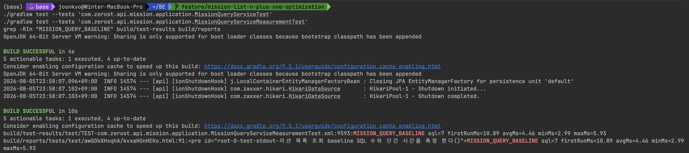

# 미션 목록 조회 N+1을 측정 가능한 성능 개선 작업으로 정리한 과정

## 1. 문제 상황

`GET /api/v1/missions`는 화면에서 자주 열리는 조회 API입니다.

이 API는 단순히 미션 목록만 내려주는 것이 아니라,

- 오늘 편성된 일반 미션 3개
- 오늘 편성된 특별 미션 1개
- 각 미션의 오늘 제출 상태
- 보상 수령 가능 여부

를 한 번에 계산해 응답해야 합니다.

겉으로는 단순한 목록 조회처럼 보이지만, 실제로는 "오늘 편성된 미션 개수만큼 상태 조회가 반복될 수 있는 구조"라서 N+1 문제가 숨어 있을 가능성이 있었습니다.

그래서 이번에는 곧바로 최적화부터 들어가기보다,

1. 현재 구조에서 실제 SQL이 몇 번 나가는지
2. 단건 호출 시간은 어느 정도인지
3. 동시 요청이 들어오면 응답 시간이 어떻게 흔들리는지

를 먼저 측정 가능한 형태로 고정해두는 작업부터 진행했습니다.

## 2. 왜 먼저 측정했는가

N+1 문제는 "느릴 것 같다"는 감각만으로 정리하면 설득력이 약합니다.

특히 이번 건은 나중에 포트폴리오에도 남길 생각이 있었기 때문에,

- 기능은 그대로 유지된 상태에서
- 개선 전 수치를 먼저 확보하고
- 같은 시나리오로 개선 후를 다시 비교

할 수 있는 구조를 만드는 것이 중요했습니다.

즉, 이번 단계의 목적은 최적화 그 자체보다,
`최적화 효과를 설명할 수 있는 기준선(baseline)을 먼저 확보하는 것`이었습니다.

## 3. 측정 기준을 어떻게 잡았는가

이번에는 측정을 두 층으로 나눴습니다.

### 1) 로컬 baseline 측정

- `MissionQueryServiceTest`
  - 기능 회귀가 없는지 확인
- `MissionQueryServiceMeasurementTest`
  - SQL 수
  - 첫 호출 시간
  - 반복 호출 평균/최솟값/최댓값

### 2) k6 부하테스트

같은 API를 다음 시나리오로 반복 호출했습니다.

- `1 VU`
  - 단일 사용자 반복 조회
- `10 VU`
  - 소규모 동시 요청
- `30 VU`
  - 중간 부하
- `50 VU`
  - 짧은 스파이크

같은 조건으로 여러 번 실행해 편차를 함께 보려고 했고,

- `1 / 10 / 30 VU`는 3회
- `50 VU`는 2회

를 기준으로 기록했습니다.

## 4. 개선 전 측정 결과

### 1) 기능 테스트 + SQL/단건 시간 baseline

| 항목 | 결과 |
| --- | --- |
| 기능 테스트 | 통과 |
| SQL 수 | `7` |
| 첫 호출 시간 | `10.89ms` |
| 반복 호출 평균 | `4.46ms` |
| 반복 호출 최소 | `2.99ms` |
| 반복 호출 최대 | `5.93ms` |

위 측정은 로컬 테스트 환경 기준입니다.

중요한 포인트는 절대 시간보다 `목록 조회 1회에 SQL이 7번 발생했다`는 점이었습니다.
오늘 편성 구조가 일반 미션 3개 + 특별 미션 1개라는 점을 감안하면, 상태 조회가 미션별로 반복될 가능성이 강하게 드러나는 수치였습니다.

### 2) k6 부하테스트 요약

| 시나리오 | 실행 횟수 | 평균 응답 시간(avg) | 평균 p95 | 평균 처리량(req/s) | 에러율 |
| --- | --- | --- | --- | --- | --- |
| `1 VU` | 3회 | `205.21ms` | `300.56ms` | `2.45` | `0.00%` |
| `10 VU` | 3회 | `166.46ms` | `249.89ms` | `17.14` | `0.00%` |
| `30 VU` | 3회 | `159.30ms` | `249.45ms` | `31.20` | `0.00%` |
| `50 VU` | 2회 | `167.06ms` | `273.57ms` | `20.89` | `0.00%` |

### 3) k6 상세 측정값

| 시나리오 | 회차 | avg | p95 | req/s | error rate |
| --- | --- | --- | --- | --- | --- |
| `1 VU` | 1 | `207.77ms` | `321.88ms` | `2.43` | `0.00%` |
| `1 VU` | 2 | `179.38ms` | `247.89ms` | `2.61` | `0.00%` |
| `1 VU` | 3 | `228.47ms` | `331.90ms` | `2.31` | `0.00%` |
| `10 VU` | 1 | `181.60ms` | `271.99ms` | `16.43` | `0.00%` |
| `10 VU` | 2 | `165.75ms` | `241.09ms` | `17.16` | `0.00%` |
| `10 VU` | 3 | `152.03ms` | `236.60ms` | `17.82` | `0.00%` |
| `30 VU` | 1 | `169.31ms` | `256.05ms` | `30.34` | `0.00%` |
| `30 VU` | 2 | `149.55ms` | `245.87ms` | `32.04` | `0.00%` |
| `30 VU` | 3 | `159.05ms` | `246.44ms` | `31.21` | `0.00%` |
| `50 VU` | 1 | `178.83ms` | `299.28ms` | `20.21` | `0.00%` |
| `50 VU` | 2 | `155.29ms` | `247.86ms` | `21.57` | `0.00%` |

### 4) baseline 캡처 자료

- [기능 테스트 + SQL 측정](../assets/mission-list-before-test-and-sql.png)
- [k6 1 VU](../assets/mission-list-before-k6-1vu.png)
- [k6 10 VU](../assets/mission-list-before-k6-10vu.png)
- [k6 30 VU](../assets/mission-list-before-k6-30vu.png)
- [k6 50 VU](../assets/mission-list-before-k6-50vu.png)

## 5. 개선 전 결과를 어떻게 해석했는가

이번 baseline에서 핵심은 두 가지였습니다.

### 1) 절대 시간보다 SQL 수가 더 중요한 신호였던 점

로컬 측정 시간만 보면 `avg 4.46ms`로 아주 작아 보입니다.
하지만 이 값만 보고 문제 없다고 판단하면 안 됩니다.

이번 측정의 핵심은 "현재 데이터 수가 작을 때도 SQL이 7번 발생한다"는 구조적 문제를 먼저 확인했다는 점입니다.

즉,

- 지금은 미션 수가 적어서 체감이 약할 수 있어도
- 상태 계산이 미션 수만큼 반복되는 구조라면
- 이후 확장 시 비용이 그대로 커질 가능성이 높았습니다.

### 2) k6 결과는 아직 병목이 폭발한 상태는 아니라는 점

`10 / 30 / 50 VU`에서도 에러율은 모두 `0%`였습니다.
즉, 개선 전이라고 해도 현재 수준에서 즉시 장애가 나는 구조는 아니었습니다.

하지만 부하가 올라가도 조회 로직이 더 효율적일 필요는 여전히 있습니다.
이번 작업은 장애 대응보다는, `조회 구조를 더 가볍고 설명 가능한 형태로 정리하는 작업`에 가깝다고 보는 편이 맞았습니다.

## 6. 개선 후 비교를 위해 남겨둔 표

### 1) 로컬 baseline 비교

| 항목 | 개선 전 | 개선 후 | 변화 |
| --- | --- | --- | --- |
| SQL 수 | `7` |  |  |
| 첫 호출 시간 | `10.89ms` |  |  |
| 반복 호출 평균 | `4.46ms` |  |  |
| 반복 호출 최소 | `2.99ms` |  |  |
| 반복 호출 최대 | `5.93ms` |  |  |

### 2) k6 비교

| 시나리오 | 개선 전 avg | 개선 후 avg | 개선 전 p95 | 개선 후 p95 | 비고 |
| --- | --- | --- | --- | --- | --- |
| `1 VU` | `205.21ms` |  | `300.56ms` |  |  |
| `10 VU` | `166.46ms` |  | `249.89ms` |  |  |
| `30 VU` | `159.30ms` |  | `249.45ms` |  |  |
| `50 VU` | `167.06ms` |  | `273.57ms` |  |  |

## 7. 이번 단계에서 의미 있었던 점

아직 최적화 코드를 적용하기 전이지만, 이번 단계만으로도 의미가 있었습니다.

- "느릴 것 같다"가 아니라 실제 SQL 수와 부하 수치를 먼저 확보했습니다.
- 기능 테스트와 성능 측정을 한 흐름으로 묶어, 이후 개선 후 비교가 가능해졌습니다.
- 로컬 baseline과 k6 부하테스트를 분리해, 구조 문제와 운영 감각을 함께 볼 수 있게 했습니다.

즉, 이번 작업은 아직 개선 완료 문서가 아니라,
`미션 목록 조회 N+1 개선을 수치로 설명하기 위한 baseline을 먼저 고정한 단계`라고 정리할 수 있습니다.
